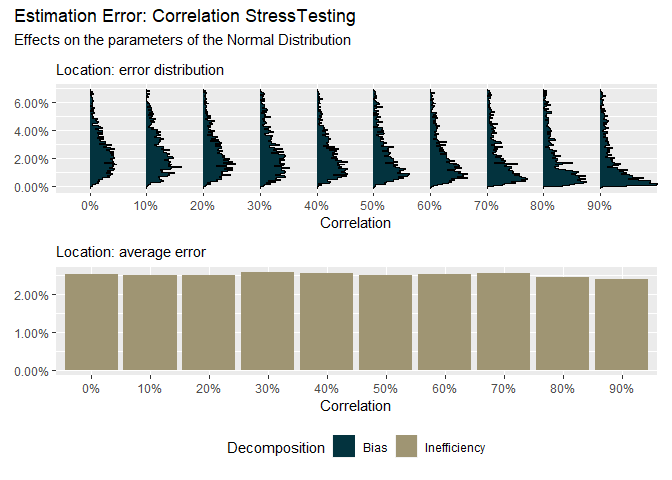

<!-- README.md is generated from README.Rmd. Please edit that file -->

# understress

<!-- badges: start -->
<!-- badges: end -->

The goal of understress is to …

## Installation

You can install the released version of understress from
[CRAN](https://CRAN.R-project.org) with:

``` r
install.packages("understress")
```

## Example

This is a basic example which shows you how to solve a common problem:

``` r
library(understress)
stress_test_multivariate_normal_distribution()
#> Cycles To Go: 10 
#> Cycles To Go: 9 
#> Cycles To Go: 8 
#> Cycles To Go: 7 
#> Cycles To Go: 6 
#> Cycles To Go: 5 
#> Cycles To Go: 4 
#> Cycles To Go: 3 
#> Cycles To Go: 2 
#> Cycles To Go: 1
```


