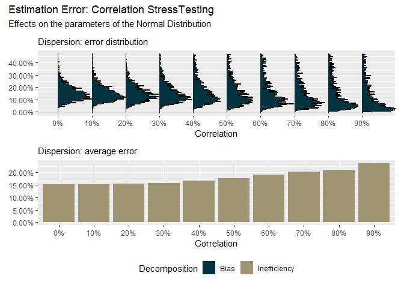

<!-- README.md is generated from README.Rmd. Please edit that file -->

# understress

<!-- badges: start -->

[](https://github.com/Reckziegel/understress/actions)
<!-- badges: end -->

> Know more about marginal PDFs estimation error

The goal of `understress` is to decompose the estimation error that
arises from marginal distributions under different correlation
environments.

By using `understress` the econometrician can better understand where
the sources of error come from and the size of their impact on current
models.

## Installation

You can install the development version of `understress` from
[GitHub](https://github.com/) with:

``` r
# install.packages("devtools")
devtools::install_github("Reckziegel/understress")
```

## Example

``` r
library(understress)
stress_test_multivariate_normal_distribution(.simulations = 2000)
#> Cycles To Go: 10 
#> Cycles To Go: 9 
#> Cycles To Go: 8 
#> Cycles To Go: 7 
#> Cycles To Go: 6 
#> Cycles To Go: 5 
#> Cycles To Go: 4 
#> Cycles To Go: 3 
#> Cycles To Go: 2 
#> Cycles To Go: 1
```


